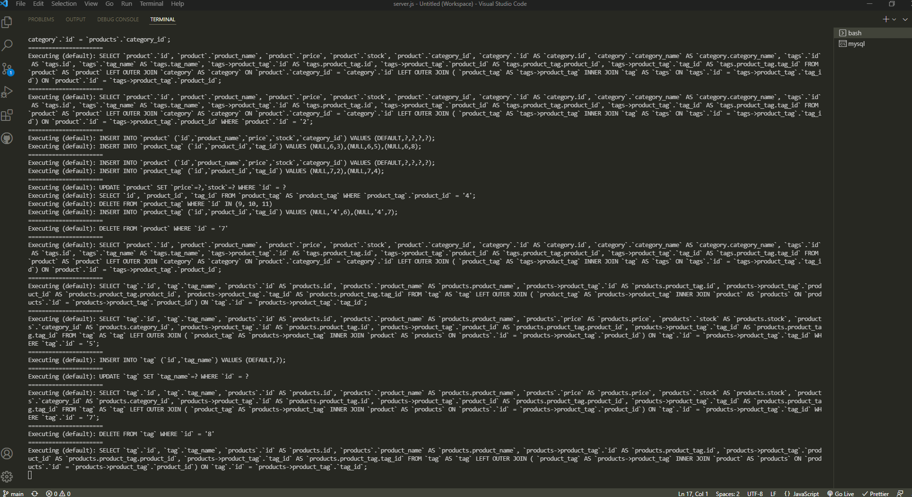
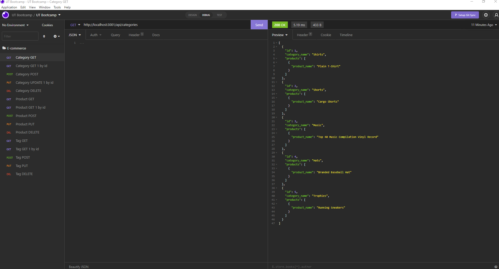
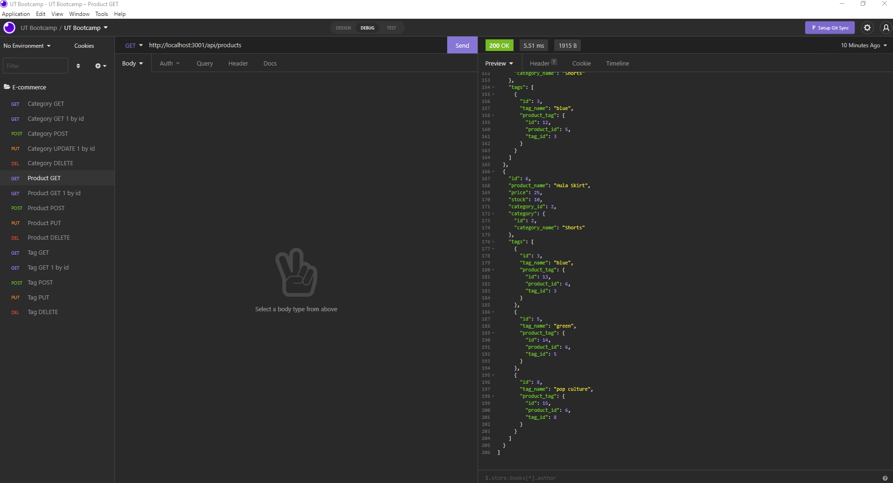

# E-Commerce Back-end

## Description

- This is the back-end of an e-commerce website. You can see, add, update, and delete stock by category, products, and tags with this application.

## Links

- https://watch.screencastify.com/v/Iwo62Rbt63hdYP6kMeHl

## Table of Contents

- [Installation](#installation)
- [Usage](#usage)
- [License](#license)
- [Images](#images)

## Installation

- Download this repository to your local machine
- Open this downloaded repository with your favorite text editor
- Install `Node.js`, if you don't already have it installed
- Find the folder location in your command line
- Run `npm install` in the command line
- Run `npm run seed` to load the seed file into the database
- Make a .env file in the root folder of the downloaded repository. In the file, add `DB_NAME=ecommerce_db`, `DB_USER=*Your MySql username`, `DB_PW=*Your MySql password`, replacing the USER and PW values with your mysql information
- Install `insomnia` to test the routes and see the output from the application
- Once the installation is complete the application will be ready to use

## Usage

- Run `npm start` in the command line, from the folder location the application is saved
- Open `insomnia` and use `http://localhost:3001` to run the routes
- The api routes you can access are `api/categories`, `api/products`, `api/tags`

## Images

## License

- This project is covered under [MIT](https://choosealicense.com/licenses/mit/)

## Questions?

- Contact me at: CMJensen82@gmail.com
- Github: https://github.com/craigmjensen/
